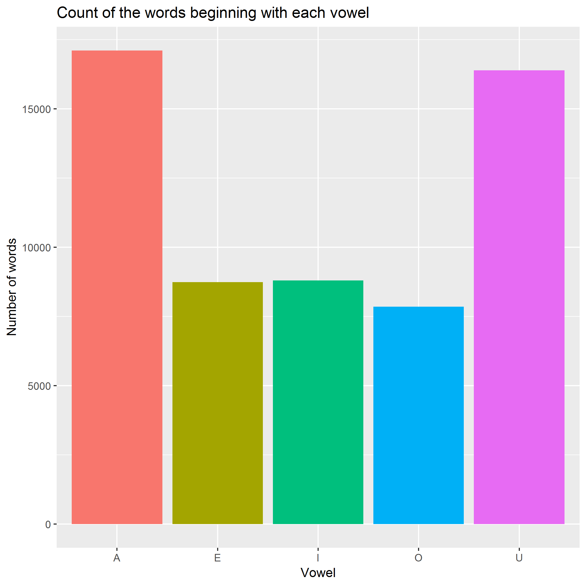

This table shows the total number of words which have a specified vowel as a first letter. The words which begin with a consonant are not included.

Below is the bar graph of the table which allows to determine the frequency with which each of the vowels appears in the first position. Most common vowel in the beginning of English words is "a", followed closely by "u". Least common vowel is "o".

